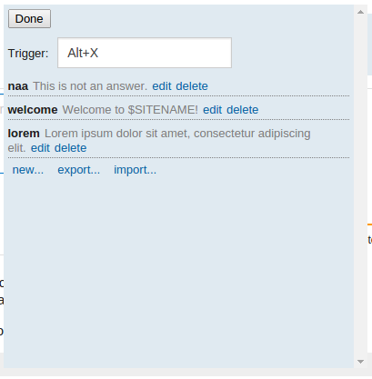
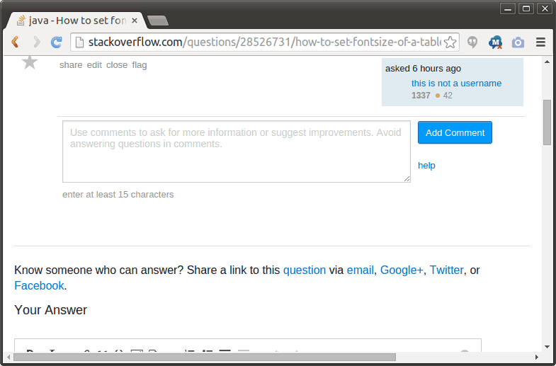

# stackexchange-quickcomment2

## Usage instructions

1. Install userscript (in Chrome, type `chrome://extensions` in the URL bar and
   drag'n'drop the qc2.user.js file into the page)
2. Visit a Stack Exchange site and start writing a comment
3. Press Alt+X, enjoy

## Screenshots

## Demo GIFs

My recording program managed to mangle the colors so badly that some of the
text isn't even visible. Sorry about that :/

### Inserting an autocomment

### Changing the hotkey

### Other settings (editing an autocomment)

### Narrowing down via typing substrings

